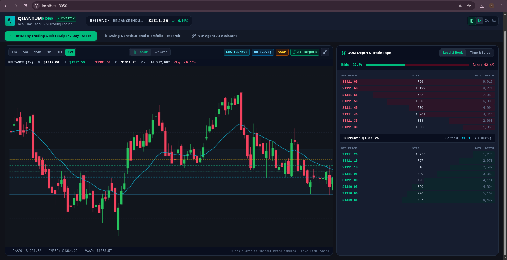
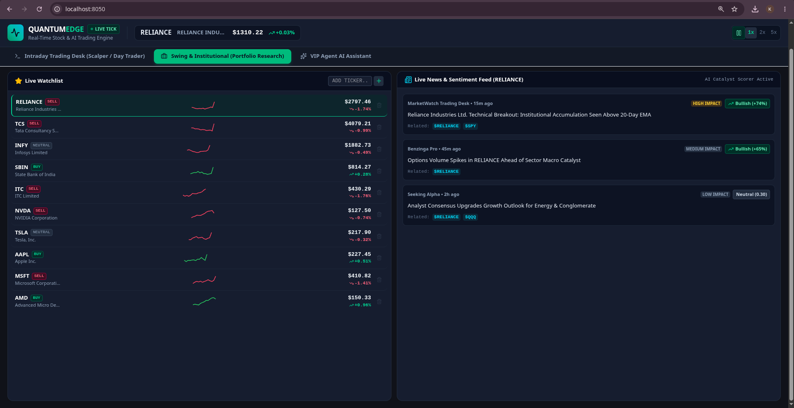

# 📈 VIP Trading Agent & Quantitative Stock Market Terminal

An institutional-grade, high-density financial workspace featuring real-time tick streaming, Level 2 Depth of Market (DOM) books, advanced ML predictors, and an integrated, context-aware AI Trading Agent.

---

## 📸 Dashboard Previews

### 1. Intraday Trading Desk & DOM Book


### 2. VIP Trading Agent Chat Console & ML Regimes


---

## 🚀 Core Features

### 1. Intraday Trading Desk
*   **Real-time Tick Streamer**: Simulated high-fidelity market data simulator with customizable speed multipliers ($1x$, $2x$, $5x$).
*   **Depth of Market (DOM) Bid/Ask Book**: Real-time Level 2 order log with cumulative volume bars and Buyer Dominance calculation.
*   **Time & Sales Tape**: Live execution ledger tracking transaction volume, price, and trade directions.
*   **High-density Charts**: Adaptive candle charts tracking VWAP and support/resistance pivot levels.

### 2. Swing & Institutional Research Desk
*   **Live Watchlist**: Monitor portfolios, cash balances, and current symbols.
*   **Macro News Catalyst Feed**: Real-time news sentiment scoring (Bullish/Bearish) and estimated market impact levels.

### 3. Integrated VIP Trading Agent Chat
*   **Context Injection**: The agent automatically receives active terminal indicators (VWAP, EMA20, RSI, MACD) and price actions on every prompt.
*   **Dynamic Model Selector**: Pulls the list of downloaded local models from your system's Ollama instance.
*   **Multi-Provider Cloud Integrations**: Easily switch to **Gemini API** or **Anthropic API (Claude)** and enter your secret keys securely in the sidebar.

### 4. Mathematical Machine Learning Predictors
*   **Linear Regression**: Calculates mathematical slope ($m$), intercept ($c$), and trend strength to forecast target prices.
*   **Naive Bayes Classifier**: Estimates probabilities of Bullish, Bearish, or Neutral market regimes based on indicator crossovers.

---

## 🛠️ Technology Stack

*   **Frontend**: React.js, Vite, Tailwind CSS, Lucide Icons.
*   **Backend Node Server**: Express.js, server-side API proxies (preventing CORS issues for Ollama, Gemini, and Anthropic).
*   **AI Models**: Ollama (`llama3`), Google Gemini (`gemini-1.5-pro`), Anthropic Claude (`claude-3-5-sonnet`).

---

## 💻 Installation & Setup

### 1. Prerequisites
Ensure you have **Node.js** (v18+) and **npm** installed.

### 2. Install Dependencies
Navigate to the dashboard directory and install package requirements:
```bash
cd src/dashboard
npm install
```

### 3. Start Local Ollama (For Local Models)
If using local LLMs, make sure Ollama is running on your system with your desired model:
```bash
ollama run llama3
```

### 4. Run the Application
Start the Node.js server and Vite frontend server concurrently:
```bash
npm run dev
```
Open **[http://localhost:8050](http://localhost:8050)** in your browser.
